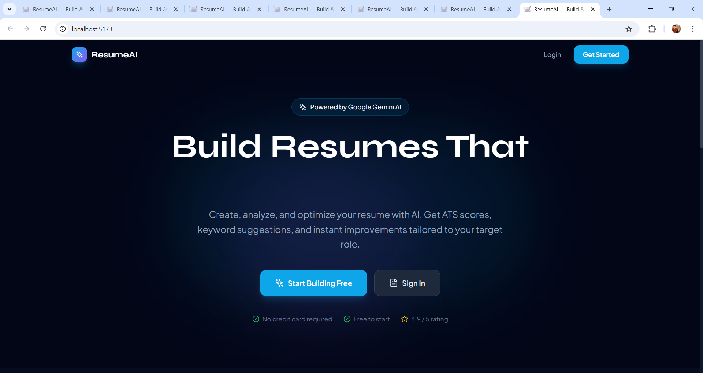
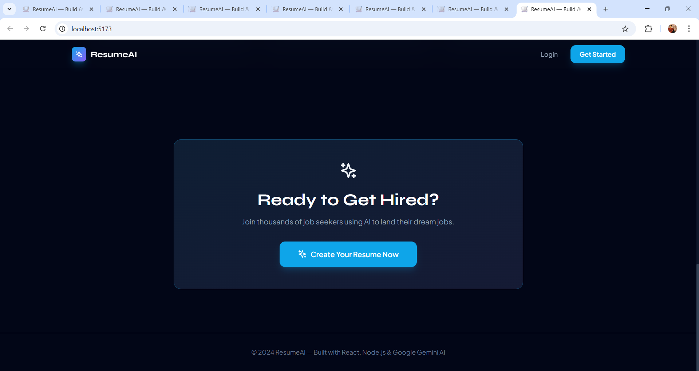
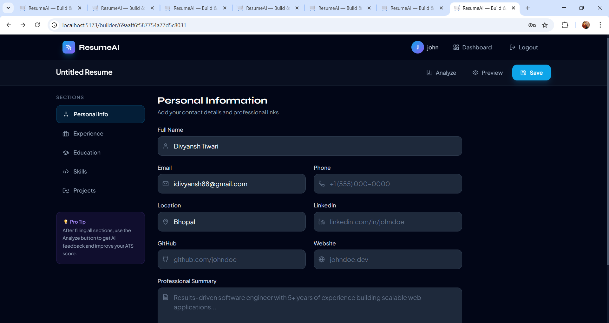
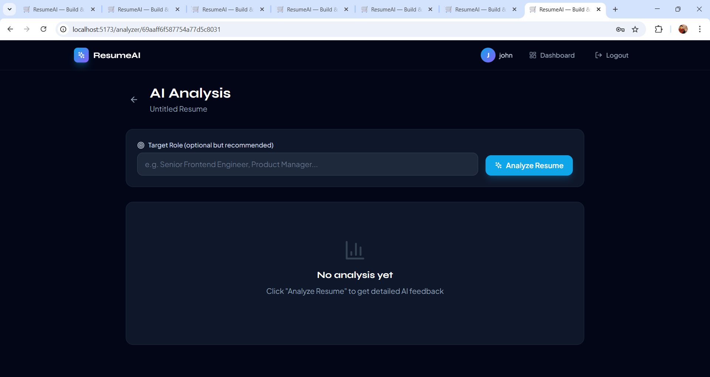
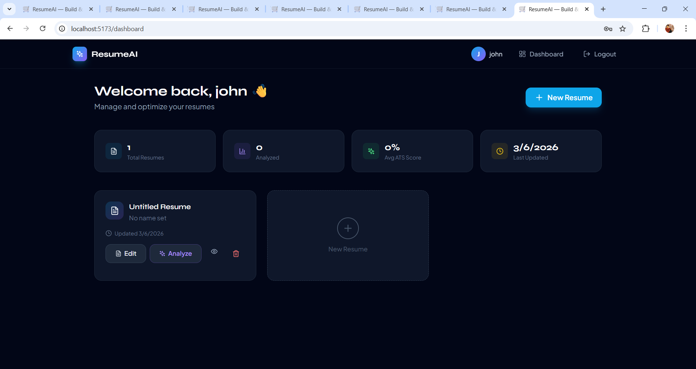
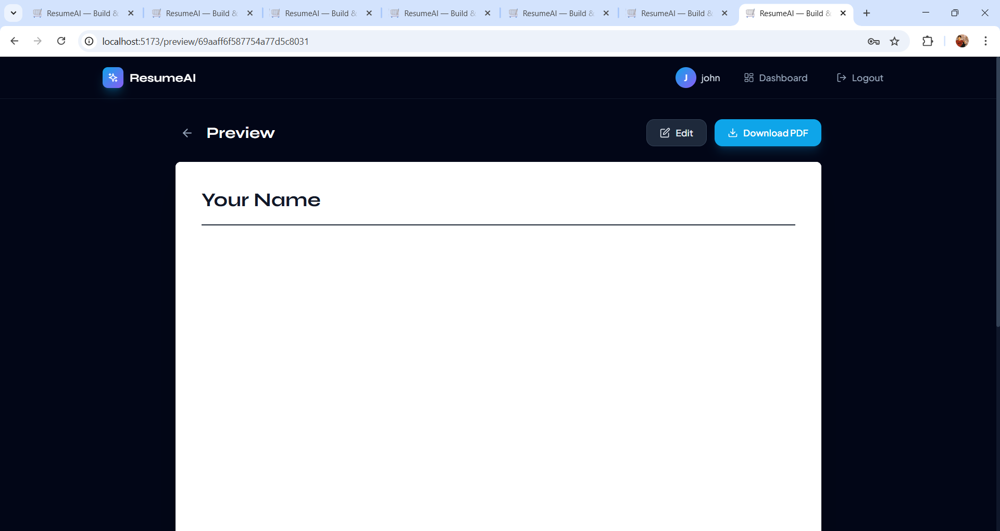

# 🚀 AI Resume Builder & Analyzer

An AI-powered **MERN stack application** that helps users **create, analyze, and optimize resumes** using **Google Gemini AI**.

The app provides ATS scoring, keyword suggestions, AI improvements, and PDF export.

---

# 🌐 Live Demo

Frontend:  
https://ai-resume-builder-omega-six.vercel.app/

Backend API:  
https://ai-resume-builder-backend-ammj.onrender.com/

---

# 📸 Screenshots

### Landing Page



### Resume Builder


### AI Analysis


### Dashboard


### Preview


---

# ✨ Features

- 📝 Resume Builder with guided sections
- 🤖 AI Resume Analysis using Gemini API
- 📊 ATS Score calculation
- 🔍 Keyword optimization for job roles
- 💡 AI suggestions for resume sections
- 📄 Export resume as PDF
- 🔐 JWT-based authentication
- 💾 Save multiple resumes
- 📊 Dashboard to manage resumes

---

# 🛠 Tech Stack

## Frontend
- React
- Tailwind CSS
- Vite
- Axios
- React Router

## Backend
- Node.js
- Express.js

## Database
- MongoDB
- Mongoose

## AI
- Google Gemini API

## Authentication
- JWT
- bcryptjs

---

# 📂 Project Structure

```
ai-resume-builder
│
├── client
│   ├── src
│   │   ├── components
│   │   ├── pages
│   │   ├── hooks
│   │   ├── context
│   │   └── utils
│   └── package.json
│
├── server
│   ├── controllers
│   ├── routes
│   ├── models
│   ├── middleware
│   ├── utils
│   └── config
│
└── README.md
```

---

# ⚡ Installation

## 1️⃣ Clone the repository

```bash
git clone https://github.com/yourusername/ai-resume-builder.git
cd ai-resume-builder
```

---

## 2️⃣ Install dependencies

```bash
npm run install-all
```

---

## 3️⃣ Environment Variables

Create:

```
server/.env
```

```
PORT=5000
MONGO_URI=mongodb://localhost:27017/ai-resume-builder
JWT_SECRET=your_secret_key
GEMINI_API_KEY=your_gemini_api_key
CLIENT_URL=http://localhost:5173
```

Create:

```
client/.env
```

```
VITE_API_URL=http://localhost:5000/api
```

---

## 4️⃣ Run the project

```bash
npm run dev
```

Frontend:

```
http://localhost:5173
```

Backend:

```
http://localhost:5000
```

---

# 📡 API Endpoints

## Auth

POST /api/auth/register  
POST /api/auth/login  
GET /api/auth/me

---

## Resumes

GET /api/resumes  
POST /api/resumes  
GET /api/resumes/:id  
PUT /api/resumes/:id  
DELETE /api/resumes/:id

---

## AI

POST /api/ai/analyze  
POST /api/ai/suggest  
POST /api/ai/ats-score  
POST /api/ai/improve-bullet

---

# 🤖 AI Features

Using **Google Gemini AI** to provide:

- Resume ATS scoring
- Keyword analysis
- Resume improvement suggestions
- Grammar & tone improvement
- Bullet point optimization
- Full resume feedback

---

# 🚀 Deployment

## Frontend

Deploy using **Vercel**

```
cd client
npm run build
```

Upload `/client/dist`.

---

## Backend

Deploy using **Render or Railway**

Deploy `/server` folder and set environment variables.

---

## Database

Use **MongoDB Atlas free cluster**

https://mongodb.com/atlas

Replace `MONGO_URI` with Atlas connection string.

---

# 👨‍💻 Author

Divyansh Tiwari

GitHub  
https://github.com/yourusername

---

# 📄 License

MIT License